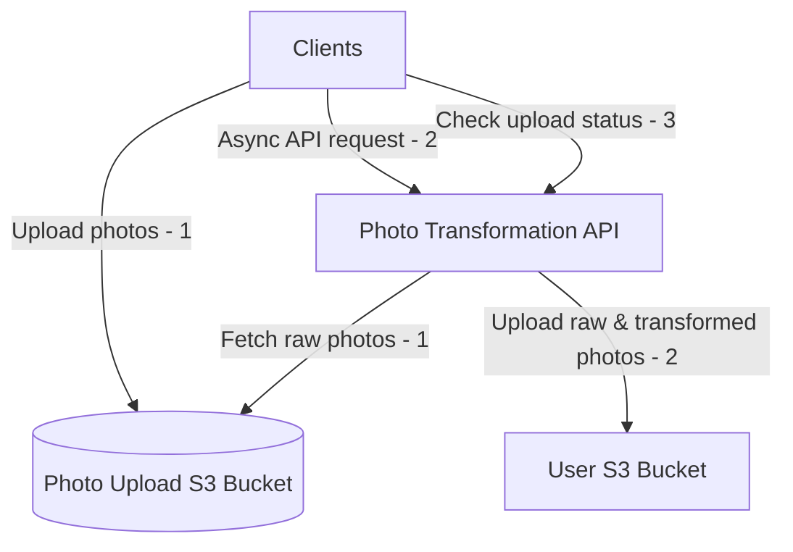

# Cheshire Games
 Pets Community Games - TBD

## Project layout
/applications   =>  contains the different applications (e.g. Mahjong, Tetris)
/services       =>  contains the different backend services (e.g. Community API, photo transformations)
/packages       =>  the packages that are needed across the repo (e.g. DynamoDB table API)

TBD - directory structure should be language agnostic?

## CI/CD
Using Github Actions as CI/CD runner, and Please for monorepo tooling.

## Flows

